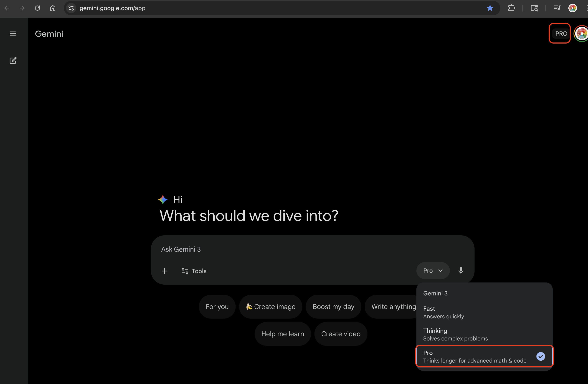

# 🚀 Getting Started & Setup

Before you begin your journey as an AI Explorer, let's get your tools ready!

---

## 🎯 What You'll Accomplish

By the end of this setup, you will:
- [ ] Have access to Google Gemini
- [ ] Be able to use Google Labs (Flow)
- [ ] Know how to access NotebookLM
- [ ] Understand privacy best practices

---

## 🛠️ Required Tools

| Tool | Purpose | URL |
|------|---------|-----|
| **Google Gemini** | Your central AI assistant | [gemini.google.com](https://gemini.google.com) |
| **Google Labs** | Creative tools (Flow) | [labs.google.com](https://labs.google.com) |
| **NotebookLM** | Research and synthesis | [notebooklm.google.com](https://notebooklm.google.com) |

### Recommended: Google AI Pro (Free Trial Available!)

While the free version works, **Google AI Pro** provides the best experience:
- **1-month free trial** - perfect for this curriculum!
- Unlocks Deep Research mode
- Higher usage limits (no interruptions mid-activity)
- Better image and code generation

**To start your free trial:** Go to [gemini.google.com](https://gemini.google.com) → Click "Try Gemini Advanced" → Start free trial

---

## 📋 Step-by-Step Setup

### Step 1: Google Account (5 minutes)

1. Open your web browser (Chrome recommended)
2. Go to **google.com**
3. Click **Sign In** in the top right
4. If you need a new account:
   - Click **Create account**
   - Select **For myself**
   - Follow the wizard

**✓ Checkpoint:** You see your profile picture in the top right of google.com

---

### Step 2: Access Google Gemini (5 minutes)

1. Open a new tab
2. Go to **[gemini.google.com](https://gemini.google.com)**
3. Sign in with your Google account
4. Accept Terms of Service if prompted
5. Test it! Type: `Hello, what can you help me with?`

**✓ Checkpoint:** You can send and receive messages in Gemini

---

### Step 3: Access Google Labs (5 minutes)

1. Open a new tab
2. Go to **[labs.google.com](https://labs.google.com)**
3. Sign in with your Google account
4. Find these tools:
   - **Flow** - Video/animation creation

**Note:** If a tool shows "Join waitlist," click it and check back later.

**✓ Checkpoint:** You can see the Google Labs homepage

---

### Step 4: Access NotebookLM (5 minutes)

1. Open a new tab
2. Go to **[notebooklm.google.com](https://notebooklm.google.com)**
3. Sign in with your Google account
4. Click **Create** or **New Notebook**
5. Explore the interface:
   - Left panel: Sources (documents you upload)
   - Right panel: Chat area

**✓ Checkpoint:** You can create a new notebook

---

### Step 5: Organize Your Workspace (2 minutes)

Keep these tabs open:
1. **Tab 1:** Google Gemini (main AI assistant)
2. **Tab 2:** Google Labs (creative experiments)
3. **Tab 3:** NotebookLM (research projects)

**Pro Tip:** Bookmark all three sites for quick access!

---

## 🔧 Troubleshooting

| Problem | Solution |
|---------|----------|
| "Access denied" message | Make sure you're signed into your Google account |
| Can't find Flow | Try refreshing or signing in again |
| NotebookLM not accessible | Make sure you're signed into your Google account |
| Page won't load | Try refreshing or clearing browser cache |
| Hit usage limits | Consider starting Google AI Pro free trial |

---

## 🔒 Privacy First

Before we begin, remember:

- **Personal Info:** Never share your full name, address, or school name with AI
- **Camera/Mic:** Always OPTIONAL - text and file uploads work too
- **Downloads:** Don't download anything unless instructed
- **Photos:** Avoid uploading photos with faces or personal information

---

## ✅ Final Checklist

Before moving on, make sure you can:

- [ ] Sign into [gemini.google.com](https://gemini.google.com)
- [ ] Access [labs.google.com](https://labs.google.com)
- [ ] Access [notebooklm.google.com](https://notebooklm.google.com)
- [ ] Send a message in Gemini and receive a response
- [ ] Bookmark all three sites

---
## Example of Gemini Pro 

---

## 🚀 Ready to Start!

You're all set up! Head to the first module to begin your AI exploration.

---

[⬅️ Back to Main Guide](../../README.md) | [Start Module 1: Mastering the Conversation ➡️](../01-multimodality/README.md)
