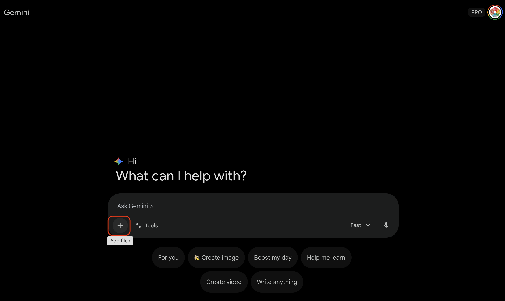
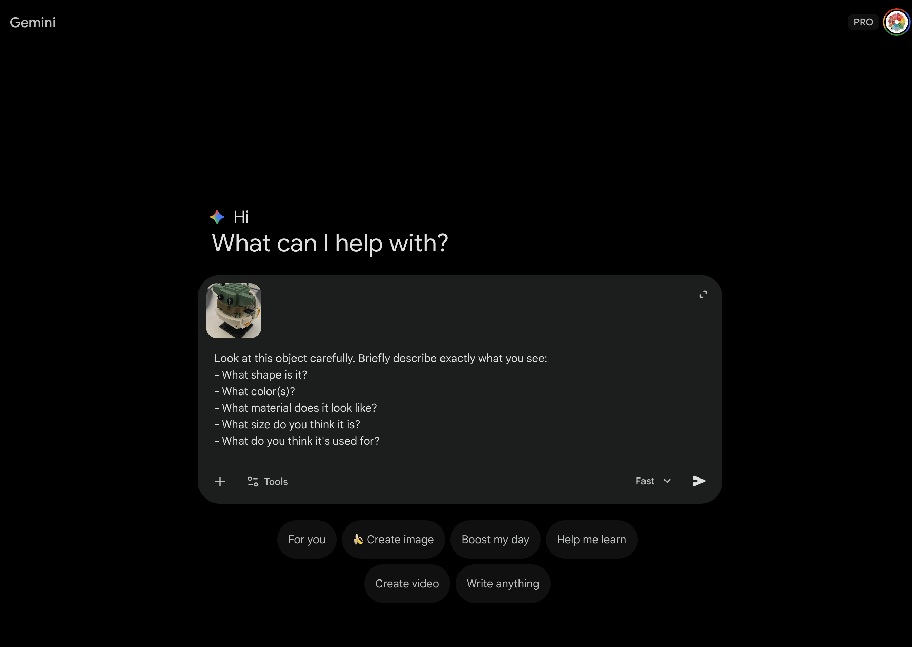
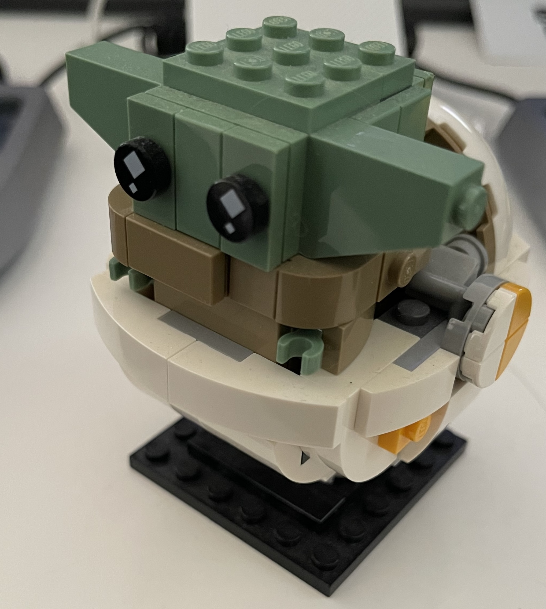
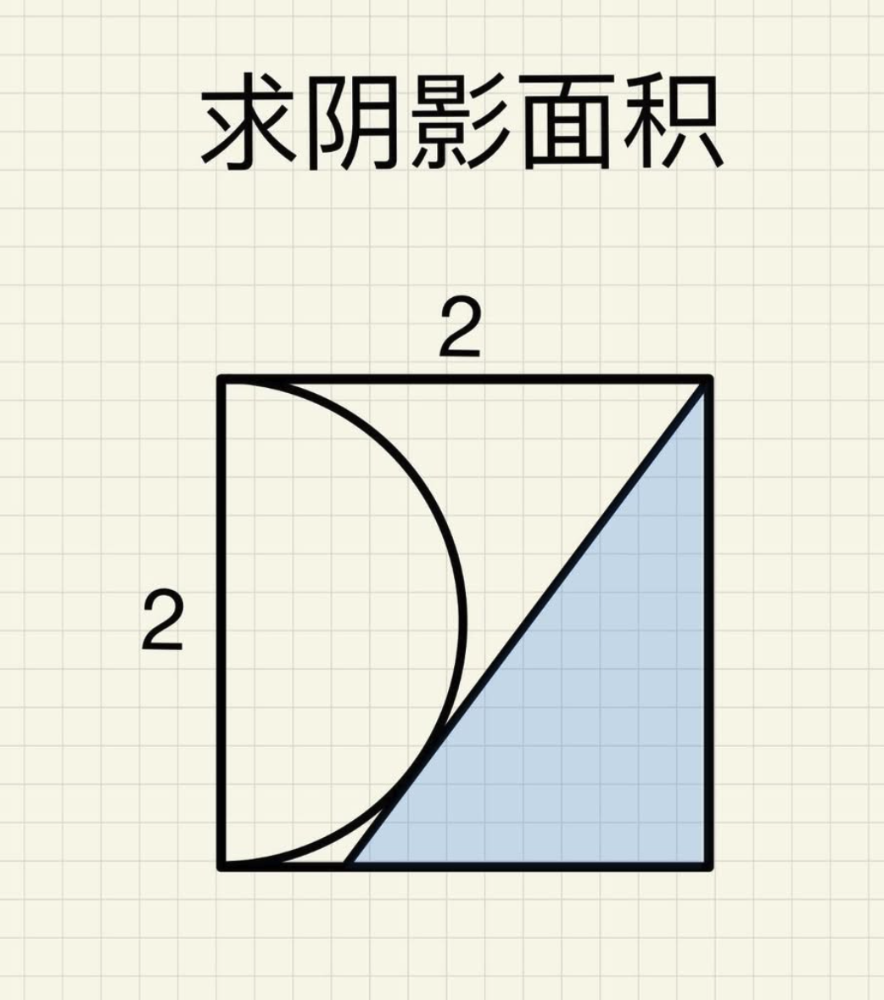

# 🗣️ Module 1: Mastering the Conversation (Input/Output)

AI can "see" images and "hear" audio, but it only works well if you give it clear instructions. This is called **Multimodality**.

---

## 🎯 Learning Objectives

By the end of this module, you will be able to:
- [ ] Give clear, specific instructions to AI
- [ ] Explain why better inputs create better outputs
- [ ] Describe how AI "sees" images differently than humans
- [ ] Use at least two different input types (text, image, or sketch)

---

## 💼 Why This Matters

| Career | How They Use This Skill |
|--------|------------------------|
| **Content Creator** | Writing prompts for AI thumbnails, scripts, and social media |
| **UX Researcher** | Using AI to analyze user feedback and find patterns |
| **AI Trainer** | Teaching AI systems by providing clear, labeled examples |
| **Marketing Manager** | Crafting prompts to generate ad copy and campaign ideas |

*The ability to communicate clearly with AI is becoming as important as typing or using search engines.*

---

## 🔑 Key Concept: What is Multimodality?

**Multimodality** means AI can understand different types of information:
- **Text** - Words and sentences
- **Images** - Photos, drawings, diagrams
- **Audio** - Voice recordings, sounds
- **Video** - Moving images with sound

**The Golden Rule:** The quality of what comes OUT depends on what you put IN.

---

## 🪜 Activity A: The Prompt Ladder

The best way to get what you want is to be specific. Try moving from "Vague" to "Detailed" with this example.

### Step 1: Pick a Topic

Choose something you want AI to describe:
- An animal (real or imaginary)
- A place (real or fantasy)
- A character (for a story)
- A food item

### Step 2: Climb the Ladder

**Copy and paste these into Gemini to see the difference:**

**Level 1 (Vague):**
```
Tell me about a cat.
```

**Level 2 (Add One Detail):**
```
Tell me about an orange cat.
```

**Level 3 (Add Context):**
```
Tell me about an orange cat that lives in a bakery.
```

**Level 4 (Full Vibe):**
```
Tell me about an orange tabby cat named Muffin who lives in a small bakery in Paris. Muffin loves to sleep on warm bread and greets every customer. Describe a typical day for Muffin.
```

### Step 3: Track Your Results

**Discussion:** Which level gave the best result? What details made the biggest difference?

---

## 🏺 Activity B: Image Recognition

Upload a photo of an everyday object and see how AI describes it. Then test if another AI can guess what it is!

### Step 1: Choose Your Object

Pick something from around you:

| Category | Examples |
|----------|----------|
| Kitchen | Fork, mug, whisk, can opener |
| School | Stapler, scissors, ruler, eraser |
| Technology | Headphones, USB cable, mouse |
| Household | Key, clothespin, rubber band |

**Tip:** Objects with interesting shapes work great!

### Step 2: Get AI's Description




1. Open **Google Gemini**
2. Take a photo of your object (or use one from your device)
3. Upload the photo and **copy/paste this prompt:**

```
Look at this object carefully. Briefly describe exactly what you see:
- What shape is it?
- What color(s)?
- What material does it look like?
- What size do you think it is?
- What do you think it's used for?
```

#### example image (if you don't have one you want to use):


4. Read AI's description - what did it notice that you didn't think about?

### Step 3: AI Guess from description

1. **Copy** the description AI gave you from the previous step
2. **Open a NEW Gemini conversation** (click "+ New chat")
3. **Paste** the description and ask:

```
Based on this description, what object do you think this is?
Can you find a picture of it online to show me?

[Paste AI's description here]
```

4. **Compare:** Does the image AI found match your original object?

### ✓ Checkpoint

- [ ] Did AI correctly identify your object from just the description?
- [ ] If not, what details were missing?
- [ ] Share with a partner: What did AI get right? What did it miss?

---

## 📐 Activity C: The Math Puzzle Helper

Sometimes referencing an image can be tricky. Let's try to solve a math puzzle with AI!



### Step 1: Ask for a Hint

Upload the image and copy/paste this prompt:

```text
Please help me to understand the math puzzle, don't reveal the answer until I request. I want you to give me meaningful hint and guide me through the problem.
```

### Step 2: Clarify the Input

If the AI seems confused, it might not be seeing the image clearly. Add a description:

```text
Please help me to understand the math puzzle, don't reveal the answer until I request. I want you to give me meaningful hint and guide me through the problem.

The circle and the shaded triangle just touch each other but didn't overlap.
```

**Why this matters:** Clear input helps the AI "see" better. Once it understands the geometry, it can unlock powerful knowledge like the **Two Tangent Theorem** and **Pythagorean Theorem** to help you.

### Step 3: The Solution

When you are ready, ask:

```text
Please reveal the answer, show me an updated image if possible.
```

---

## 🤝 Activity D: Prompt Partners Challenge

Work with a partner to see how different prompts get different results!

### The Challenge

1. **Pair up** with a classmate
2. **Pick the same topic** (example: "a robot")
3. **Each person writes their own prompt** - don't show each other!
4. **Both submit** your prompts to Gemini
5. **Compare results** - whose prompt worked better? Why?

### Example Comparison

| Student A's Prompt | Student B's Prompt |
|-------------------|-------------------|
| "Draw a robot" | "Draw a friendly helper robot with big blue eyes, silver body, and wheels instead of feet. It's waving hello." |

**Discuss:**
- Whose result was more interesting?
- What made the difference?
- What would you add to make it even better?

### Bonus: Remix Your Partner's Prompt

Take your partner's prompt and make it even MORE specific. See if you can beat their result!

---

## 📝 Reflection Journal

```
MY INPUT/OUTPUT EXPERIMENT

ACTIVITY A - Prompt Ladder
Topic I chose: _______________
Best prompt I wrote: _______________
Why it worked: _______________

ACTIVITY B - Alien Archaeologist
Object I chose: _______________
Did AI guess it correctly? Yes / No
What detail helped AI the most? _______________

THE BIG IDEA:
Better inputs = Better outputs because:
_______________________________________________

ONE THING I'LL DO DIFFERENTLY NEXT TIME:
_______________________________________________
```

---

## 🚀 Extension Activities

If you finish early or want extra practice:

### Telephone Game with AI
1. Student A describes an object in words (no photo)
2. AI generates an image based on the description
3. Student B looks at AI's image and describes it
4. AI generates a new image from Student B's description
5. Compare the final image to the original - how much changed?

### The Detail Detective
Pick an object and see how many details you can list:
- Start with 3 details → get AI's response
- Add 3 more details → get AI's response
- Add 3 more details → get AI's response
- Which version was best? What details mattered most?

### Prompt Battle
Two students compete:
1. Pick the same topic
2. You have 2 minutes to write the best prompt
3. Both submit to AI
4. Class votes on which result is better
5. Winner explains their prompt strategy

---

## 📚 Key Vocabulary

| Term | Definition |
|------|------------|
| **Input** | What you give to the AI (text, images, audio) |
| **Output** | What the AI gives back to you |
| **Prompt** | The instructions or question you give to AI |
| **Multimodal** | Able to process multiple types of information |
| **Context** | Background information that helps AI understand better |

---

## ✅ Skills Checklist

By the end of this module, you should be able to:

- [ ] Access and use Google Gemini independently
- [ ] Upload images to an AI chat interface
- [ ] Write a clear, detailed prompt
- [ ] Explain how input quality affects output quality
- [ ] Identify what information helps AI perform better
- [ ] Give examples of different input types (text, image, audio)

---

## 🏠 Take-Home Challenge

Try these activities with a family member:

1. **Photo Description Game**
   - Take a photo of something at home
   - Have AI describe it
   - See if a family member can guess what it is from AI's description alone

2. **Prompt Ladder Practice**
   - Pick any topic
   - Write 4 prompts from vague → detailed
   - Show a family member how the results improve

3. **Come Prepared**
   - Bring your best prompt to share next time!

---

[⬅️ Back to Main Guide](../../README.md) | [Next Module: Digital Art & Animation ➡️](../02-creative-remix/README.md)
