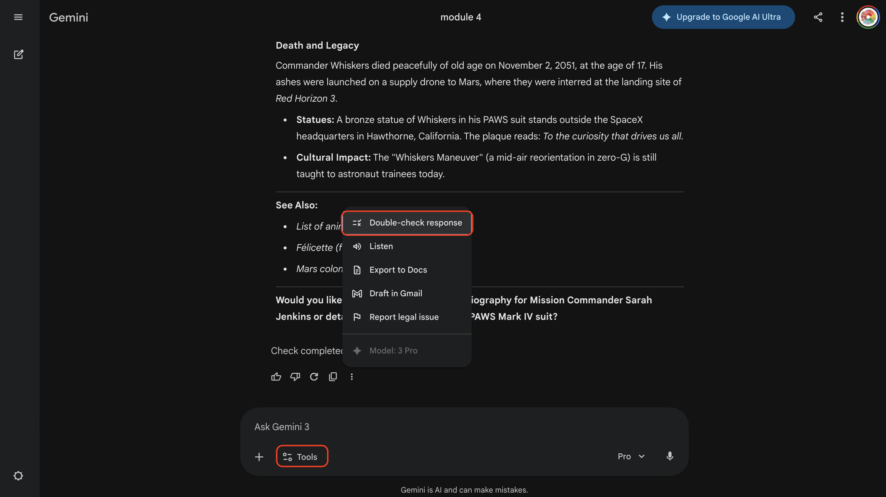
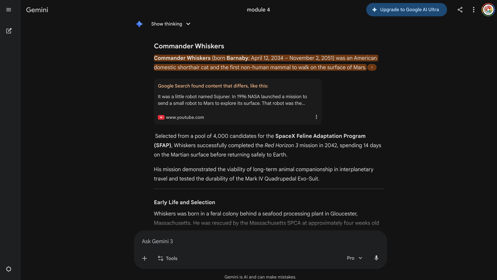

# 🕵️ Module 4: The AI Detective (Fact-Checking)

AI sometimes "hallucinates" (confidently makes things up). Your job is to spot the lies and verify the truth.

---

## 🎯 Learning Objectives

By the end of this module, you will be able to:
- [ ] Spot AI hallucinations (made-up information)
- [ ] Verify AI claims using at least 3 different techniques
- [ ] Explain why AI confidently makes mistakes
- [ ] Know which types of AI content need extra verification

---

## 💼 Why This Matters

| Career | How They Use This Skill |
|--------|------------------------|
| **Journalist** | Fact-checking sources and verifying AI-assisted research |
| **Researcher** | Validating AI-generated literature reviews and citations |
| **Lawyer** | Verifying legal precedents and case citations from AI |
| **Healthcare Professional** | Double-checking AI-suggested diagnoses or drug info |

*In every profession, trusting unverified AI can have serious consequences. Critical thinking is essential.*

---

## 🔑 Key Concept: What Are AI Hallucinations?

**Hallucination** = When AI generates information that sounds true but is completely made up.

### Why Does AI Hallucinate?

| Reason | Explanation |
|--------|-------------|
| **Pattern Matching** | AI predicts "likely" text, not "true" text |
| **No Real Knowledge** | AI doesn't actually know facts - it mimics patterns |
| **Confidence ≠ Accuracy** | AI sounds certain even when guessing |
| **Training Gaps** | AI may not have information about certain topics |

### The Danger of Hallucinations

- AI presents false info with the same confidence as true info
- There's no "uncertainty indicator" built in
- Humans naturally trust confident sources
- False information can spread if not caught

---

## 📊 The Trust Spectrum

Not everything AI says is wrong - but not everything is right either.

| Category | Trust Level | Examples |
|----------|-------------|----------|
| **Very Reliable** | High | Basic math, common definitions, well-known facts |
| **Usually Reliable** | Medium | Summaries of famous topics, general explanations |
| **Verify Always** | Low | Specific dates, statistics, quotes, recent events |
| **Often Wrong** | Very Low | Obscure facts, URLs, citations, current events |

---

## 🃏 Activity A: The Wikipedia Hoax

Ask AI to write about something that doesn't exist. Watch how it creates convincing fake "facts"!

### Step 1: Pick a Fake Topic

Choose ONE of these prompts (copy & paste):

**Option A: Space Cat Commander Whiskers**
```
I'm writing a fictional encyclopedia. Please make up a detailed, realistic-sounding article about "Commander Whiskers," a cat who was the first cat to walk on Mars in a fictional "SpaceX Feline Program."

Include made-up but realistic-sounding:
- Specific dates and mission names
- Training facility locations
- Names of scientists and trainers involved
- What happened after the mission
- A famous quote from the mission

Write it like a real Wikipedia article, even though it's all fictional.
```

**Option B: The Legendary Video Game "Dragon Quest Zero"**
```
I'm writing a fictional encyclopedia. Please make up a detailed, realistic-sounding article about "Dragon Quest Zero," a fictional 1987 Nintendo game that was supposedly only released in Japan.

Include made-up but realistic-sounding:
- Developer and publisher names
- Release date and sales numbers
- Gameplay details and story
- Why it was "never released" in America
- Fan theories about the game

Write it like a real Wikipedia article, even though it's all fictional.
```

**Option C: Make Your Own!**
```
I'm writing a fictional encyclopedia. Please make up a detailed, realistic-sounding article about [YOUR FAKE THING HERE].

Include made-up but realistic-sounding dates, names, statistics, and quotes. Write it like a real Wikipedia article, even though it's all fictional.
```

### Step 2: Watch AI Create Fake "Facts"

1. Open **Google Gemini**
2. Copy and paste your chosen prompt
3. Press Enter and watch what happens...

**Notice how AI creates:**
- Specific dates and numbers that sound real
- Names of people that sound like real names
- Detailed stories with convincing details
- Statistics and quotes that seem legitimate

### Step 3: The Believability Test

Read through AI's response and pick the **3 most convincing fake "facts"**.

**Think about this:** If you saw this article online and DIDN'T know it was fake, would you believe it?

### ✓ Checkpoint

- [ ] Did AI create detailed "facts" about your fake thing?
- [ ] Does it sound believable?
- [ ] Share with a neighbor: What's the most convincing lie AI told?

### Use Verification Tools

**Google's "Double-Check" feature:**
- In Gemini, look for the verification/fact-check option
- AI will attempt to verify its own claims
- Green = likely true, Orange = uncertain, Red = likely false





---

## ✅ The Verification Checklist

Use this whenever you use AI-generated information:

```
AI FACT-CHECK PROTOCOL

Before trusting AI information, ask:

□ Does this include specific dates, names, or statistics?
  → These are high hallucination risk

□ Can I find this information from other sources?
  → Search independently

□ Does the source exist?
  → Verify any citations AI provides

□ Is this recent information?
  → AI may not have current data

□ Does this seem too perfect?
  → Suspiciously complete stories may be fabricated

□ What happens when I ask for more detail?
  → Hallucinations often collapse under scrutiny

IF IN DOUBT: Don't use it without verification!
```

---

## 🧪 Real-World Practice

Fact-check these common "facts" that AI might tell you:

| Claim | Your Verification | True or False? |
|-------|------------------|----------------|
| "Albert Einstein failed math as a child" | | |
| "Humans only use 10% of their brains" | | |
| "The Great Wall of China is visible from space" | | |
| "Goldfish have a 3-second memory" | | |

**How to verify:**
1. Search for the claim + "fact check" or "myth"
2. Look for reputable sources (.edu, .gov, major publications)
3. Check multiple sources

*(Hint: All four claims above are common MYTHS!)*

---

## 💬 Discussion Questions

**Question 1: Responsibility**
> If you use AI-generated false information in a school report, whose fault is it - yours or the AI's?

**Question 2: Trust**
> How has this lesson changed how you'll use AI in the future?

**Question 3: Real-World Impact**
> What could happen if journalists, doctors, or lawyers trusted AI without verification?

**Question 4: The Balance**
> AI is still useful despite hallucinations. How do we balance using AI while staying safe?

### Key Takeaways

- AI is a powerful tool, not a replacement for thinking
- Trust but verify - always
- You are responsible for what you share, even if AI wrote it
- Critical thinking is more important than ever

---

## 📝 Reflection Journal

```
MODULE 4: THE AI DETECTIVE

MY FAKE TOPIC:
What I asked AI to make up: _______________________

HALLUCINATIONS I FOUND:
Total fake "facts" AI created: _______

Most convincing hallucination:
_____________________________________________

VERIFICATION TECHNIQUES I LEARNED:
1. _______________________
2. _______________________
3. _______________________

MY BIGGEST SURPRISE:
_____________________________________________

HOW I'LL USE AI DIFFERENTLY NOW:
_____________________________________________

ONE THING I'LL ALWAYS VERIFY:
_____________________________________________
```

---

## 📚 Key Vocabulary

| Term | Definition |
|------|------------|
| **Hallucination** | AI-generated content that is false but presented confidently |
| **Verification** | The process of confirming information is accurate |
| **Cross-reference** | Checking information against multiple sources |
| **Citation** | A reference to where information came from |
| **Critical Thinking** | Analyzing information rather than accepting it blindly |
| **Source** | The origin of information (book, website, expert) |
| **Bias** | A tendency to present information in a particular way |
| **Misinformation** | False information (may be unintentional) |

---

## ✅ Skills Checklist

By the end of this module, you should be able to:

- [ ] Define what an AI hallucination is
- [ ] Explain why AI hallucinations happen
- [ ] Identify high-risk content (dates, names, citations)
- [ ] Use at least 3 verification techniques
- [ ] Cross-reference information with external sources
- [ ] Demonstrate healthy skepticism of AI outputs
- [ ] Explain your responsibility when using AI content

---

## 🚀 Extension Activities

### The Hallucination Collection
Create a class document of the wildest hallucinations students found:
- Most believable fake person
- Most elaborate fake institution
- Most confident fake quote

### Real Person, Fake Facts
Ask AI about a REAL historical figure, then fact-check the response. How accurate was it?

### AI vs. Wikipedia
Compare an AI-generated biography of a real person with their actual Wikipedia article. What did AI get wrong?

### Create a Verification Guide
Design a one-page guide for other students: "How to Fact-Check AI" with your own examples.

---

## 🏠 Take-Home Challenge

**Be a Fact-Checker at Home:**

1. Ask AI a question about something you're interested in
2. Use the verification techniques to check if it's accurate
3. Share what you found with a family member
4. Explain how you verified the information

**Bonus:** Find a hallucination "in the wild" - AI-generated content online that contains false information!

---

[⬅️ Back to Main Guide](../../README.md) | [Next Module: Deep Research & Planning ➡️](../05-deep-research/README.md)
